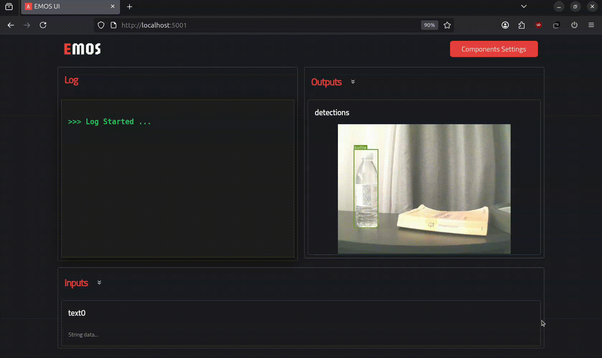

<div align="center">
  <picture>
    <source media="(prefers-color-scheme: dark)" srcset="docs/_static/Emos_dark.png">
    <source media="(prefers-color-scheme: light)" srcset="docs/_static/Emos_light.png">
    
  </picture>
<h2>The Embodied Operating System</h2>

<p><strong>The open-source unified orchestration layer for Physical AI.</strong></p>

<p>
<a href="https://emos.automatikarobotics.com/"></a>
<a href="LICENSE"></a>
<a href="https://discord.gg/B9ZU6qjzND"></a>
<a href="https://emos.automatikarobotics.com/getting-started/installation.html"></a>
</p>

<p>
<a href="https://emos.automatikarobotics.com/">Documentation</a> &middot;
<a href="https://emos.automatikarobotics.com/getting-started/installation.html">Installation</a> &middot;
<a href="https://emos.automatikarobotics.com/getting-started/quickstart.html">Quick Start</a> &middot;
<a href="https://emos.automatikarobotics.com/recipes/overview.html">Recipes</a> &middot;
<a href="https://discord.gg/B9ZU6qjzND">Discord</a>
</p>

</div>

---

EMOS is the open-source software layer that transforms quadrupeds, humanoids, and mobile robots into **Physical AI Agents**. It decouples the robot's body from its mind, providing a hardware-agnostic runtime that lets robots see, think, move, and adapt -- orchestrated entirely from pure Python scripts called **Recipes**.

Write a Recipe once. Deploy it on any robot. No code changes.

<p align="center">
  <picture>
    <source media="(prefers-color-scheme: dark)" srcset="docs/_static/images/diagrams/emos_robot_stack_dark.png">
    <source media="(prefers-color-scheme: light)" srcset="docs/_static/images/diagrams/emos_robot_stack_light.png">
    
  </picture>
</p>

```python
from agents.clients.ollama import OllamaClient
from agents.components import VLM
from agents.models import OllamaModel
from agents.ros import Topic, Launcher

text_in  = Topic(name="text0", msg_type="String")
image_in = Topic(name="image_raw", msg_type="Image")
text_out = Topic(name="text1", msg_type="String")

model  = OllamaModel(name="qwen_vl", checkpoint="qwen2.5vl:latest")
client = OllamaClient(model)

vlm = VLM(
    inputs=[text_in, image_in],
    outputs=[text_out],
    model_client=client,
    trigger=text_in,
)

launcher = Launcher()
launcher.add_pkg(components=[vlm])
launcher.bringup()
```

That's a complete robot agent. It sees through a camera, reasons with a vision-language model, and responds -- all running as a managed ROS2 lifecycle node.

## Architecture

EMOS is built on three open-source components that work in tandem:

<p align="center">
  <picture>
    <source media="(prefers-color-scheme: dark)" srcset="docs/_static/images/diagrams/emos_diagram_dark.png">
    <source media="(prefers-color-scheme: light)" srcset="docs/_static/images/diagrams/emos_diagram_light.png">
    
  </picture>
</p>

| Component | Layer | What It Does |
| :--- | :--- | :--- |
| [**EmbodiedAgents**](https://github.com/automatika-robotics/embodied-agents) | Intelligence | Agentic graphs of ML models with semantic memory, multi-modal perception, and event-driven adaptive reconfiguration. |
| [**Kompass**](https://github.com/automatika-robotics/kompass) | Navigation | GPU-accelerated planning and control for real-world mobility. Cross-vendor SYCL support -- runs on Nvidia, AMD, Intel, and others. |
| [**Sugarcoat**](https://github.com/automatika-robotics/sugarcoat) | System Primitives | Lifecycle-managed components, event-driven system design, and a Pythonic launch API that replaces XML configuration. |

The three layers form a vertical stack. Sugarcoat provides the execution primitives. Kompass builds navigation nodes on top of them. EmbodiedAgents builds cognitive nodes on the same foundation. At runtime, the **Launcher** brings everything to life from a single Python script -- the Recipe.

## What Makes EMOS Different

**Hardware-agnostic Recipes.** A security patrol Recipe written for a wheeled AMR runs identically on a quadruped. EMOS handles kinematic translation and action commands beneath the surface.

**Event-driven autonomy.** Robots must adapt to chaos. EMOS enables behavior switching at runtime based on environmental context -- not just internal state. If a cloud API disconnects, the Recipe triggers a fallback to a local model. If the navigation controller gets stuck, an event fires a recovery maneuver. Failure is a control flow state, not a crash.

```python
# Cloud API fails? Switch to local backup automatically.
llm.on_algorithm_fail(action=switch_to_backup, max_retries=3)

# Emergency stop? Restart the planner and back away.
events_actions = {
    event_emergency_stop: [
        ComponentActions.restart(component=planner),
        unblock_action,
    ],
}
```

**GPU-accelerated navigation.** Kompass moves heavy geometric planning to the GPU, achieving up to **3,106x speedups** over CPU-based approaches. It is the first navigation framework with cross-vendor GPU support via SYCL.

**ML models as first-class citizens.** Object detection outputs can trigger controller switches. VLMs can alter planning strategy. Vision components can drive target following. The intelligence and navigation layers are deeply integrated through a shared component model.

**Auto-generated web UIs.** EMOS renders a fully functional web dashboard directly from your Recipe definition -- real-time telemetry, video feeds, and configuration controls with zero frontend code.

<p align="center">

</p>

## Installation

**Via the EMOS CLI** (recommended for deployment):

```bash
curl -sSL https://raw.githubusercontent.com/automatika-robotics/emos/main/stack/emos-cli/install.sh | sudo bash
emos install YOUR-LICENSE-KEY
```

**From source** (for development):

```bash
# Prerequisites: ROS 2 (Iron or later), Python 3.10+
mkdir -p emos_ws/src && cd emos_ws/src

git clone https://github.com/automatika-robotics/sugarcoat
git clone https://github.com/automatika-robotics/embodied-agents
git clone https://github.com/automatika-robotics/kompass

pip install numpy opencv-python-headless 'attrs>=23.2.0' jinja2 httpx \
    setproctitle msgpack msgpack-numpy platformdirs tqdm pyyaml toml websockets

# Install Kompass core (GPU recommended)
curl -sSL https://raw.githubusercontent.com/automatika-robotics/kompass-core/refs/heads/main/build_dependencies/install_gpu.sh | bash
# Or CPU-only: pip install kompass-core

cd emos_ws
rosdep update && rosdep install -y --from-paths src --ignore-src
colcon build && source install/setup.bash
```

You also need a model serving platform. EMOS supports [Ollama](https://ollama.com), [RoboML](https://github.com/automatika-robotics/robo-ml), [vLLM](https://github.com/vllm-project/vllm), [LeRobot](https://github.com/huggingface/lerobot), and any OpenAI-compatible endpoint.

## Recipes

Recipes are not scripts. They are complete agentic workflows that combine intelligence, navigation, and system orchestration into a single, readable Python file.

**The General-Purpose Assistant** -- routes verbal commands to the right capability using semantic intent:

```python
router = SemanticRouter(
    inputs=[query_topic],
    routes=[llm_route, goto_route, vision_route],
    default_route=llm_route,
    config=router_config
)
```

**The Vision-Guided Follower** -- fuses depth and RGB to track a human guide without GPS or SLAM:

```python
controller.inputs(
    vision_detections=detections_topic,
    depth_camera_info=depth_cam_info_topic
)
controller.algorithm = "VisionRGBDFollower"
```

The [documentation](https://emos.automatikarobotics.com/recipes/overview.html) includes 16 recipes covering conversational agents, prompt engineering, semantic mapping, tool calling, VLA manipulation, point navigation, vision tracking, multiprocessing, runtime fallbacks, and event-driven cognition.

## AI-Assisted Recipe Development

EMOS publishes an [`llms.txt`](https://emos.automatikarobotics.com/llms.txt) -- a structured context file designed for AI coding agents. Feed it to your preferred LLM and let it write Recipes for you.

## Running Recipes

With the EMOS CLI:

```bash
emos recipes              # Browse available recipes
emos pull vision_follower  # Download one
emos run vision_follower   # Launch it
```

Custom recipes go in `~/emos/recipes/<name>/` with a `recipe.py` and `manifest.json`. See the [CLI guide](https://emos.automatikarobotics.com/getting-started/cli.html) for details.

## Contributing

EMOS has been developed in collaboration between [Automatika Robotics](https://automatikarobotics.com/) and [Inria](https://inria.fr/). Contributions from the community are welcome.

## License

Copyright 2024-2026 [Automatika Robotics](https://automatikarobotics.com/). See the [LICENSE](LICENSE) file for details.
