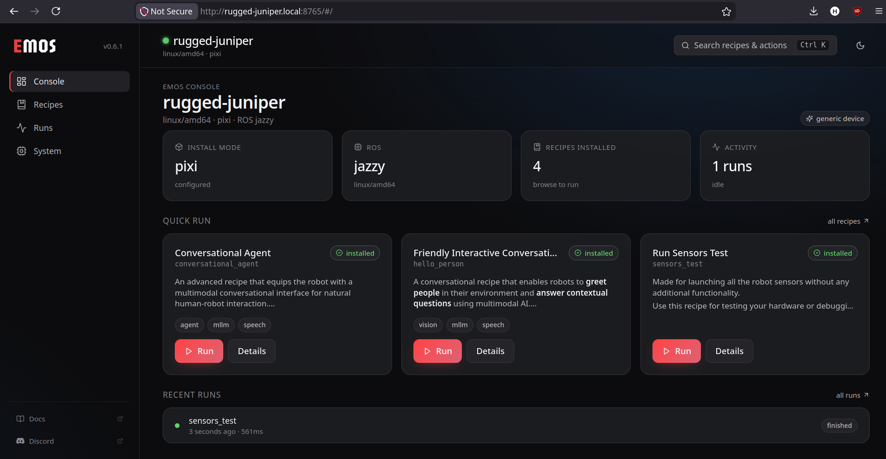

# EMOS Dashboard

The EMOS Dashboard is a web app that runs on your robot. Once you open it in a browser, you can browse and install recipes, start and stop them, and watch what they do — all without touching a terminal. It's the recommended way to use EMOS on a freshly unboxed robot.



## What you get

- A **home page** that shows what your robot is, whether something is running, and one-click shortcuts to start a recipe.
- A **recipes library** with a built-in catalog you can install from with one click.
- A **live console** that streams a recipe's output as it runs.
- A **system page** that tells you the robot's name on the network, the URLs to open from other devices, and a QR code to scan with your phone.

You don't need to install anything extra to use the dashboard — it ships with EMOS.

## Open it for the first time

After you install EMOS, open a terminal on the robot and run:

```bash
emos serve
```

You'll see a block like this:

```text
EMOS DASHBOARD

Robot identity: rugged-juniper
Reach the dashboard from a browser:
  http://rugged-juniper.local:8765
  http://localhost:8765
  http://192.168.1.42:8765
  http://emos.local:8765

Pairing code (shown once): 482917
Save it now — it is not stored in plaintext on disk.

  ▄▄▄▄▄▄▄  ▄ ▄▄  ▄▄▄▄▄▄▄
  █ ▄▄▄ █ ▀▄ ██  █ ▄▄▄ █ ...
```

Three things to notice:

1. **Robot identity** — your robot has been given a friendly name (`rugged-juniper` here). This is how you'll find it from your laptop or phone.
2. **The URLs** — pick whichever one your laptop can reach. From the same Wi-Fi, `http://rugged-juniper.local:8765` usually works directly. If `.local` doesn't resolve (most Android phones), use the IP address — e.g. `http://192.168.1.42:8765`.
3. **The pairing code** — six digits, shown only on first launch. You'll type it into the browser to grant that browser access.

```{important}
The pairing code is shown **once**. If you lose it, you can mint a new one any time with `emos config rotate-pairing`.
```

### Pair the browser

<!-- TODO(gif): docs/_static/images/dashboard/pair_flow.gif — full pairing UX: scan QR → pair page opens → enter code → token issued → redirected to dashboard -->

Open one of the URLs in your browser. The dashboard notices it's the first visit and shows a **Pair** screen — type the six-digit code from the terminal and you're in. The browser remembers the pairing for ~90 days, so you won't have to do this again unless you clear cookies, switch browsers, or revoke the access.

To pair a phone the same way, point its camera at the QR code that the terminal printed; the QR opens the same Pair screen with the code pre-filled.

## The seven views

The dashboard has seven pages. The sidebar (or the command palette — press {kbd}`Ctrl`+{kbd}`K` / {kbd}`⌘`+{kbd}`K` to open it) lets you jump between them.

### Home

<!-- TODO(screenshot): docs/_static/images/dashboard/home.png — Dashboard view: identity tile, status pills (mode, distro, uptime), most-recent run card, "Pull a recipe" empty state if no installs -->

A one-glance view of the robot: identity, install status, how long it's been up, and what (if anything) is running right now. If you haven't installed any recipes yet, you'll see a friendly card suggesting one to try first.

<!-- TODO(screenshot): docs/_static/images/dashboard/empty_state.png — empty Installed grid + "Pull conversational_agent to try EMOS in 60 seconds" card -->

### Recipes

<!-- TODO(gif): docs/_static/images/dashboard/recipes_pull.gif — Catalog tab → click "Get" on a recipe card → optimistic card slides into Installed grid → progress fills card border via SSE → done -->

The library, with two tabs:

- **Installed** — what's already on this robot.
- **Catalog** — recipes published by Automatika that you can install with one click.

Tap **Get** on a catalog card and the recipe downloads in the background; the card fills in as it progresses and shows up under Installed when it's done. If your robot is offline, the Catalog tab will tell you so — your already-installed recipes will keep working, you just can't browse the catalog until the robot can reach the internet.

```{tip}
The bar at the top of the page shows whether your robot is currently online. It refreshes itself every few seconds, so you'll know immediately if connectivity comes back.
```

### Recipe Detail

<!-- TODO(screenshot): docs/_static/images/dashboard/recipe_detail.png — recipe detail page: description, required sensors table (topic + msg type + hardware), other topics, recent-runs list, "Run" button -->

Click any installed recipe to see what it does. The page shows:

- A short description.
- The **sensors** the recipe expects (camera, lidar, microphone, …) — and, when relevant, suggested driver packages to install if a sensor is missing.
- Recent runs of this recipe.
- A **Run** button.

If a sensor your recipe needs isn't connected, the run will warn you up-front rather than silently hanging.

### Runs

A timeline of every recipe you've run recently. Click any row to open its console.

### Run Console

<!-- TODO(gif): docs/_static/images/dashboard/run_logs.gif — clicking Run on a recipe → redirected to RunDetail → live logs streaming with ANSI colour → click Stop → process tree reaped, status flips to Cancelled -->

The live view of a running recipe. Output streams in real time, with colour and a follow-tail toggle so you can scroll back without losing your place. Closing the browser tab does **not** stop the recipe — there's a **Stop** button for that.

The status pill at the top tells you whether the recipe is starting up, running, finished, failed, or was cancelled.

### System

<!-- TODO(screenshot): docs/_static/images/dashboard/system.png — System page: identity, mode/distro/version, hostname/IPs, mDNS name, paired devices count, TLS fingerprint when --tls is on, QR for inviting another device -->

This is the page you'll want when you need to invite a phone or another laptop to the same robot. It shows:

- The robot's name and how to reach it (mDNS name, IP addresses).
- A **QR code** to scan from another device — opens the same Pair screen on that device.
- A list of paired browsers (you can revoke any of them).
- Robot install info (mode, ROS distribution, version) and a button to copy any field.

### Pair

The first-touch screen. You only see it when the browser doesn't have a token yet — once it's paired, it never asks again.

## Inviting another phone or laptop

Open the **System** page on a device that's already paired, and either:

- Have the new device scan the QR code, or
- Type the code into the new device's browser at the same URL.

Both devices end up paired against the same robot.

## I lost the pairing code

The robot doesn't keep the code in readable form on disk for security reasons. To issue a new one:

```bash
emos config rotate-pairing
```

Already-paired browsers stay paired — this just creates a fresh code for the next device that wants in.

## Make the dashboard start automatically

If you'd rather not run `emos serve` by hand each time, ask the robot to run it at boot:

```bash
sudo emos serve install-service
```

The `emos install` flow already offers to do this for you. To turn it off later:

```bash
sudo emos serve uninstall-service
```

## Naming your robot

Every robot is given a friendly name on first boot — `rugged-juniper`, `swift-eagle`, that kind of thing. It survives reboots and reinstalls so you can always type `http://<name>.local:8765` and find it. To pick your own:

```bash
emos config set name happy-robot
sudo systemctl restart emos-dashboard.service   # if running at boot
```

## Manage paired devices

To see who has access to your robot:

```bash
emos config tokens
```

To remove a single device by its label or short ID:

```bash
emos config revoke-token phone
```

To revoke everyone at once and start over:

```bash
emos config rotate-pairing   # fresh code; existing tokens still valid
```

```{tip}
You can also see and revoke paired devices from the dashboard's **System** page.
```

## A note on browser security warnings

The dashboard runs over plain `http://` by default, on your local network only. That's the right default for a home or workshop — your robot is reachable to devices on your Wi-Fi but not to the wider internet, and the pairing code is what gates access.

If you'd like the lock icon in the browser address bar, there's an opt-in HTTPS mode using a self-signed certificate — see [HTTPS (Optional)](cli.md#https-optional) in the CLI reference for setup, fingerprint verification, and how to add the certificate to your browser's trust store so the warning goes away permanently.

```{seealso}
[CLI Reference](cli.md) for the commands the dashboard runs under the hood. Advanced users who want to integrate with their own tools can look at [`internal/server/openapi.yaml`](https://github.com/automatika-robotics/emos/blob/main/stack/emos-cli/internal/server/openapi.yaml) for the dashboard's REST API.
```

## Trouble?

```{seealso}
[Troubleshooting](troubleshooting.md) — the **Dashboard** section covers the common bumps: lost pairing code, can't open `emos.local`, the dashboard says "not installed" even though I installed something, and similar.
```
