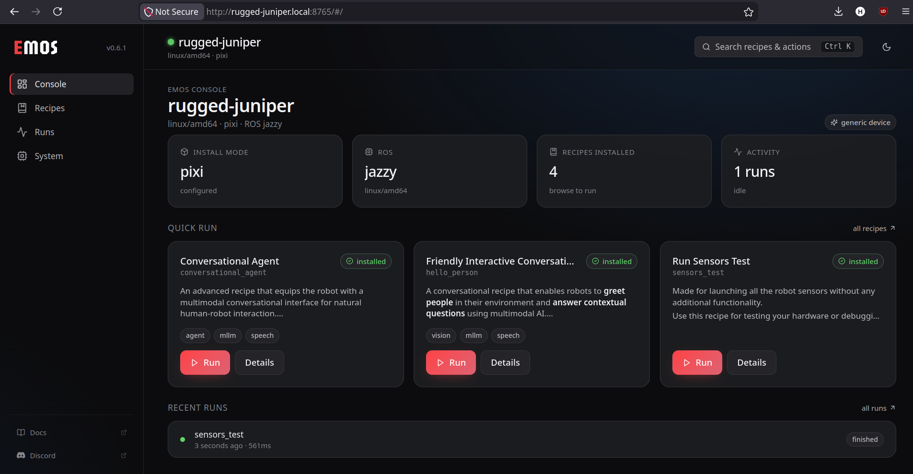
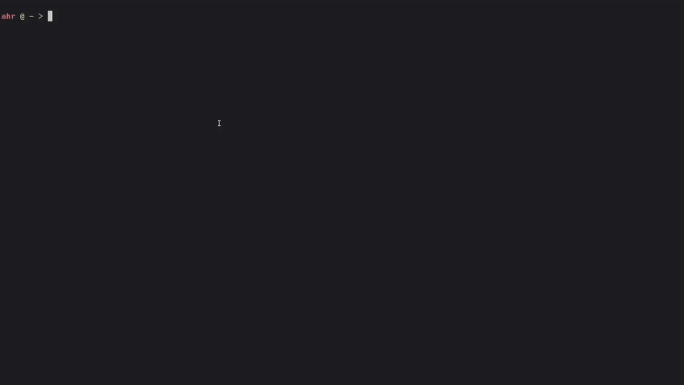
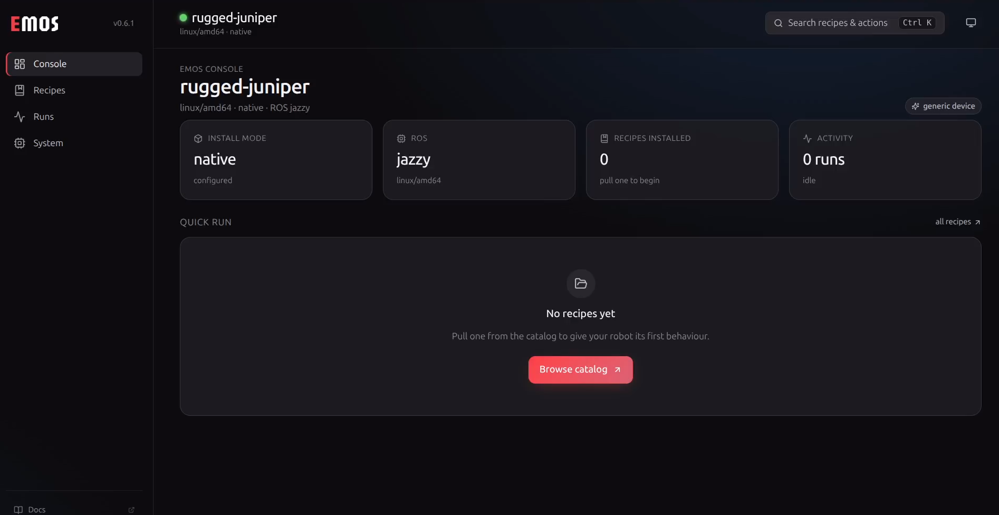
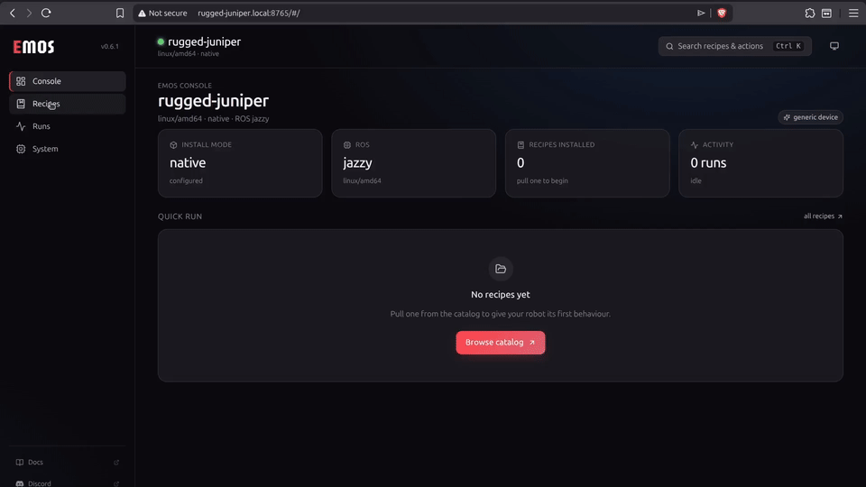
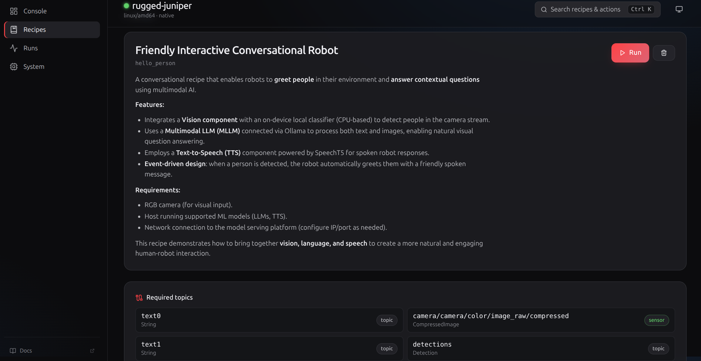
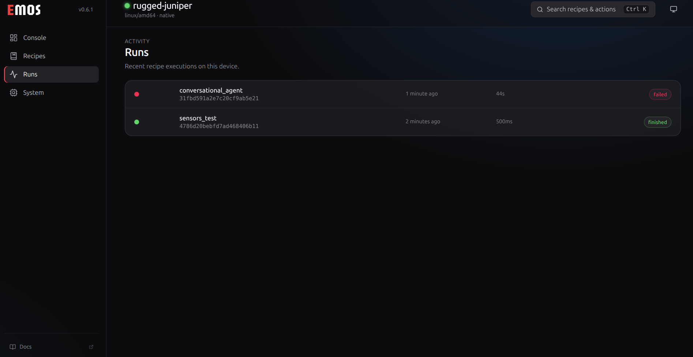
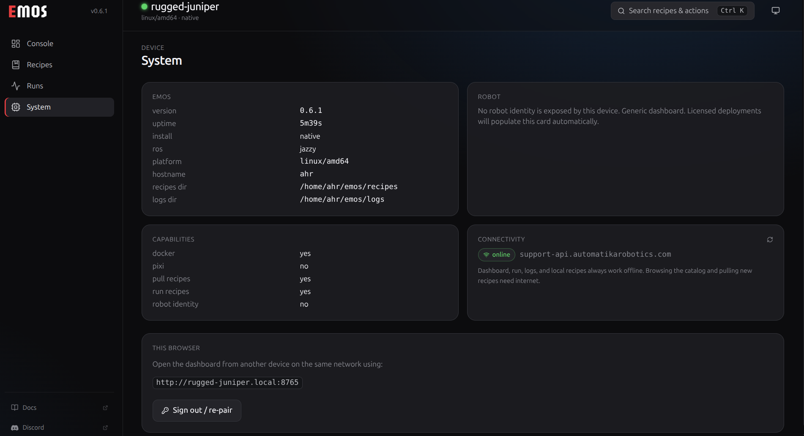

# EMOS Dashboard

The dashboard is a web app that runs on the robot. Open it in a browser and you can install recipes from the catalog, start and stop them, watch their output, and see what the robot is and what it can do, all without a terminal. It ships with EMOS, so there is nothing extra to install, and on a freshly set up robot it is the easiest way to get going.



## Open it for the first time

If you said yes when the installer offered to start the dashboard at boot, it is already running. Otherwise start it from a terminal on the robot:

```bash
emos serve
```

Either way you will have seen a block like this, printed by the installer or by `emos serve`:

```text
EMOS DASHBOARD

Robot identity: rugged-juniper
Reach the dashboard from a browser:
  https://rugged-juniper.local:8765
  https://localhost:8765
  https://192.168.1.42:8765
  https://emos.local:8765

TLS fingerprint (verify on first browser warning):
  8B:F2:0C:...:E7

Pairing code (shown once): 482917
Enter it in the browser, or scan the QR below with a phone to auto-pair.
Save it now — it is not stored in plaintext on disk.

  ▄▄▄▄▄▄▄  ▄ ▄▄  ▄▄▄▄▄▄▄
  █ ▄▄▄ █ ▀▄ ██  █ ▄▄▄ █ ...
```

Three things in there matter. The **robot identity** is a friendly name the robot picked for itself (`rugged-juniper` here), and it is how you will find the robot from a laptop or a phone. The **URLs** are the addresses the dashboard answers at; from the same Wi-Fi, `https://rugged-juniper.local:8765` usually works, and if `.local` names do not resolve on your device (most Android phones), use the IP address instead. The **pairing code** is what you type into the browser to be let in.

```{important}
The pairing code is printed once and never stored in readable form on the robot. If you lose it, `emos config rotate-pairing` mints a new one.
```

### Pair the browser



Open one of the URLs. The first thing the browser shows is a security warning, because the robot signs its own certificate. Compare the fingerprint in the browser's certificate details with the one printed above, then continue. You land on the **Pair** screen; type the six-digit code and you are in. The browser remembers the pairing for about 90 days, so you will not have to do this again unless you clear its storage, switch browsers, or revoke the access from the robot.

A phone pairs even faster: point its camera at the QR code in the terminal. It opens the Pair screen with the code already filled in.

## Dashboard views

The sidebar has five pages: Console, Recipes, Plugins, Runs and System. You can also jump anywhere, or start a recipe, from the command palette, which opens with {kbd}`Ctrl`+{kbd}`K` or {kbd}`⌘`+{kbd}`K`.

### Console



The home page. It shows what the robot is, how it is installed, how many recipes it has and whether one is running right now. The first three installed recipes get a **Run** button right here, and the most recent runs are listed underneath. On a robot with no recipes yet, it points you to the catalog.

### Recipes



Your recipe library, in two tabs. **Installed** is what is on the robot. **Catalog** is what Automatika publishes and you can install with one click: press **Get** on a card and the recipe downloads in the background, then moves over to the Installed tab when it is done. **Details** opens a page with the full description before you decide.

The catalog needs the robot to be online. If it is not, the tab says so, and everything already installed keeps working in the meantime; the cloud icon in the page header tells you when the robot can reach the internet again.

### Recipe Detail



Open an installed recipe to see its description and the topics it uses. Each topic is marked with where it comes from: the robot plugin, a named sensor plugin, a plain ROS sensor topic, or some other topic. If a recipe needs a robot or sensor plugin that is not installed, the page says so and links you to the Plugins page. The **Run** button starts the recipe and takes you to its live console. Only one recipe runs at a time, so while one is running the button waits until you stop it.

### Plugins

<!-- TODO screenshot: Plugins page, installed robot + sensor cards above the catalog -->

A robot runs one robot plugin plus any number of sensor plugins, and this page is where you manage both. Installed plugins are shown at the top, the robot first and the sensors below it, each with its description and a count of the feeds, actions and events it provides, and a **Remove** button. Below that is the catalog. **Install** puts a robot plugin on a robot that has none, **Replace robot** swaps it for another one, **Add** adds a sensor plugin, and **Reinstall** refreshes a plugin that is already there. Progress streams onto the card while a plugin is being fetched and built.

This is the browser side of `emos plugin`. [Plugins](plugins.md) has the whole story.

### Runs

<!-- TODO screenshot: Runs page, the list of recent runs -->

Every recipe run, newest first, with its status and how long it took. Click one to open its console.

### Run Console



The live view of a run. Output arrives as it happens, in colour, with a filter box and a level filter for when there is a lot of it, and a tail button to jump back to the end. The pill at the top says whether the recipe is starting, running, finished, failed, or was stopped, and while it runs there is a **Stop** button. Closing the tab does not stop the recipe.

### System



Everything about the robot itself. When a robot plugin is installed, the page opens with the robot: its picture, model and vendor, and the sensors, other feeds, actions and events the plugin exposes. Sensor plugins get a card each. Below that come the install details (version, mode, ROS distribution, the recipe and log directories), what the robot can do (Docker, pixi, pulling and running recipes), and its connectivity, with a button to check again.

The last card, **This browser**, shows the address to use from another device on the same network, and a **Sign out** button that forgets this browser's pairing.

## Inviting another phone or laptop

Pairing happens per browser, and there are two ways to bring another device in. Have it scan the QR code that `emos serve` prints, which fills the code in for it, or open the dashboard address on the new device and type the code. If the code is long gone, `emos config rotate-pairing` prints a fresh one. Browsers that are already paired stay paired.

## Make the dashboard start automatically

The installer offers this, but you can turn it on at any later time:

```bash
emos serve install-service
```

Run it as your user, not with `sudo`; it escalates on its own where it must. From then on the dashboard comes up at boot as a systemd service, and `emos serve` only prints the access details instead of starting a second one. To turn it off again:

```bash
emos serve uninstall-service
```

## Naming your robot

The friendly name the robot gave itself survives reboots and reinstalls, so `https://<name>.local:8765` keeps working. To pick a name of your own:

```bash
emos config set name happy-robot
sudo systemctl restart emos-dashboard.service   # if running at boot
```

Names are lowercase letters, digits and dashes.

## Security

The dashboard is meant to be reachable only on the robot's local network, and it is protected in two ways: every connection is encrypted, and every request needs a paired browser.

### The certificate

The dashboard serves HTTPS with a certificate the robot creates for itself the first time `emos serve` or `emos run` runs, kept in `~/emos/.ui-security/`. Because no public authority signed it, browsers warn about it on first contact. The warning is about trust, not encryption: the connection is encrypted either way. To make sure you are talking to your robot and not to something in between, compare the fingerprint the browser shows under its certificate details with the one from the robot:

```bash
emos config tls-fingerprint
```

Once they match, continue past the warning. To stop the warning from coming back, import `~/emos/.ui-security/tls.crt` into the browser's trust store: in Firefox under *Settings → Privacy & Security → Certificates → View Certificates → Authorities → Import*, ticking "Trust this CA to identify websites"; in Chrome and Edge through the operating system's store (`update-ca-certificates` on Linux, Keychain Access on macOS, `certmgr.msc` on Windows).

The certificate lists the robot's name and the network addresses it had when it was created. After the robot moves to another network, or you rename it, make a new one and restart the dashboard:

```bash
emos config tls-regenerate
sudo systemctl restart emos-dashboard.service
```

Recipe web UIs use the same certificate, so a browser that trusts the dashboard trusts them too.

### Paired browsers

A paired browser holds a token that is valid for about 90 days. You can see who is paired and revoke any of them from the robot:

```bash
emos config tokens                     # list paired browsers
emos config revoke-token phone         # by label, or by the short id
emos config rotate-pairing             # fresh pairing code; paired browsers stay paired
emos config reset                      # revoke everyone and start over
```

A running dashboard picks up a rotated code straight away. Requests to the dashboard's port over plain HTTP are redirected to HTTPS; `emos serve --no-tls` and `--no-auth` exist for development on a laptop and nothing else.

```{seealso}
[CLI Reference](cli.md) for the commands behind the dashboard. Advanced users who want to integrate with their own tools can look at [`internal/server/openapi.yaml`](https://github.com/automatika-robotics/emos/blob/main/stack/emos-cli/internal/server/openapi.yaml) for the dashboard's REST API.
```

## Trouble?

```{seealso}
[Troubleshooting](troubleshooting.md) covers the common bumps: a lost pairing code, `emos.local` not resolving, the certificate warning coming back, and a dashboard that says "not installed" even though EMOS is installed.
```
